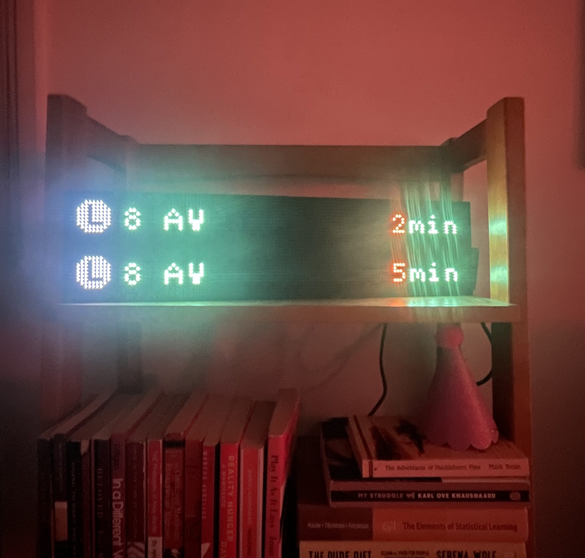

## NYC Subway sign (🗽🍎🚉)

This project aims to re-create the iconic NYC train arrival signs that indicate the wait time until the next subway arrives. The project has 3 components:

1. Reading data from the MTA API (see [arrivals.py](./arrivals.py))
2. Creating a UI that shows train arrivals (see [UI.py](./UI.py))
3. Hardware setup, configuration, and start/stop [shell scripts](./scripts/start.sh)

Here is an image of the subway sign on my bookshelf.



### Hardware Needed

- [Raspberry Pi Zero](https://www.adafruit.com/product/3400) (with 2x20 headers attached)
- SD card and writer if you dont have already
- [Adafruit HAT](https://www.adafruit.com/product/3211)
- [two 64x32 LED Panels](https://www.adafruit.com/product/2277)
- [power source](https://www.adafruit.com/product/1466) (see note)

### Pi Software Setup

Once the pi is wired, run the commands below. For the rpi-matrix setup, select the Adafruit HAT configuration.

```sh
sudo apt-get update
sudo apt-get install vim git tmux python3 python3-pip python3-dev python3-pillow -y
git clone https://github.com/c-koster/nyc-subway-sign
curl https://raw.githubusercontent.com/adafruit/Raspberry-Pi-Installer-Scripts/main/rgb-matrix.sh > rgb-matrix.sh
sudo bash rgb-matrix.sh
python3 -m pip install -r nyc-subway-sign/requirements.txt
```


Add the following lines as environment variables in the `.env` file:
```sh
MTA_API_KEY="key-goes-here-XcQ"
STATION_TO_TRACK="L11N"
LINES_TO_TRACK="L"
```

To turn on and off automatically, crontab needs the following entries (try `crontab -e`):

```
0 8 * * *  sudo /home/pi/nyc-subway-sign/scripts/start.sh # START 8am every morning
0 22 * * * sudo /home/pi/nyc-subway-sign/scripts/stop.sh  # STOP 10pm every evening
# reboot to check for github changes
```


### Notes & Errata

- The MTA train signs list each train's final destination next to the line-name. This destination will change on the sign if there is track maintinence (e.g. if the L train has track maintinence between Union Square and 8th ave, the sign should say `14 St-Union Sq`). However I was not able to find an online resource which could give me this information dynamically so I went with uptown/downtown station names exracted from [stops.txt](./resources/stops.txt). The labels for these first and last stations can be found in [line_ends.txt](./resources/line_ends.txt).

- Technically each panel could draw up to 4A if all the LEDs were set to full white at the same time (8A total). In this project, many of the LEDs are switched off so a 4A supply is fine. 

### Resources

- https://pypi.org/project/underground/
- https://medium.com/@skalyani103/wheres-my-train-9c8431c76b7f 
- https://github.com/maxxscholten/nyc-train-sign 
- https://github.com/ty-porter/RGBMatrixEmulator/
- https://www.raspberrypi.com/news/nyc-train-sign/